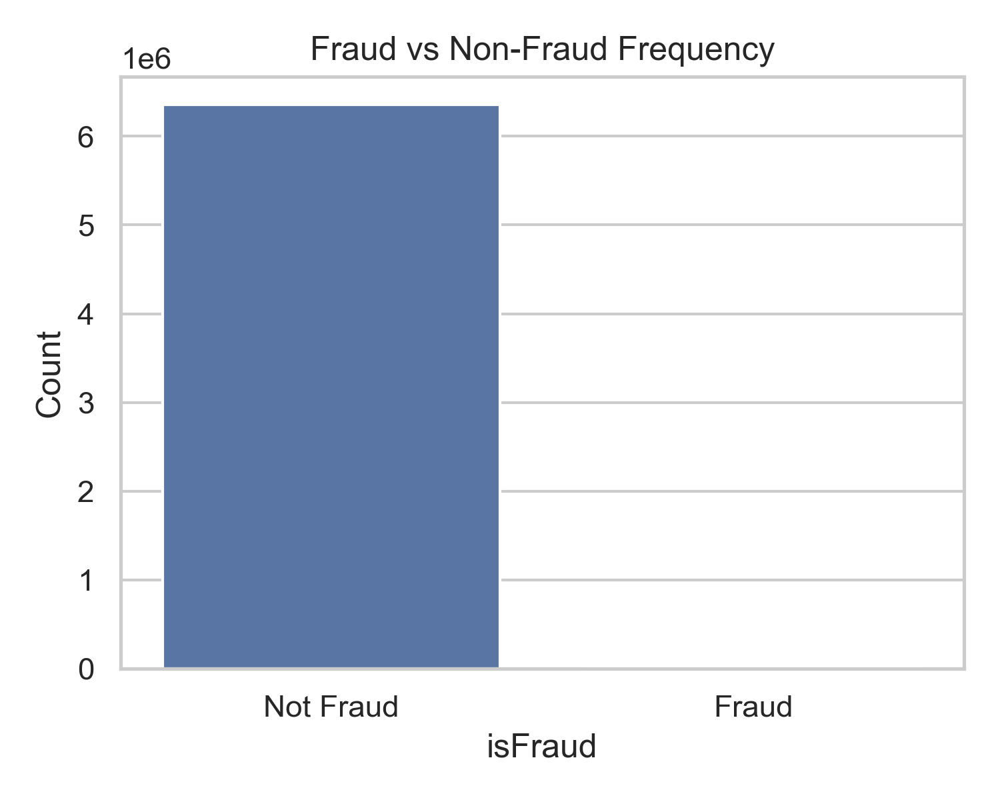
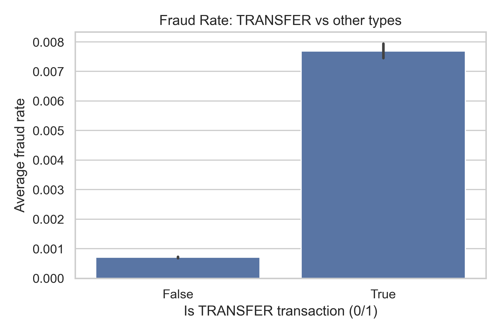
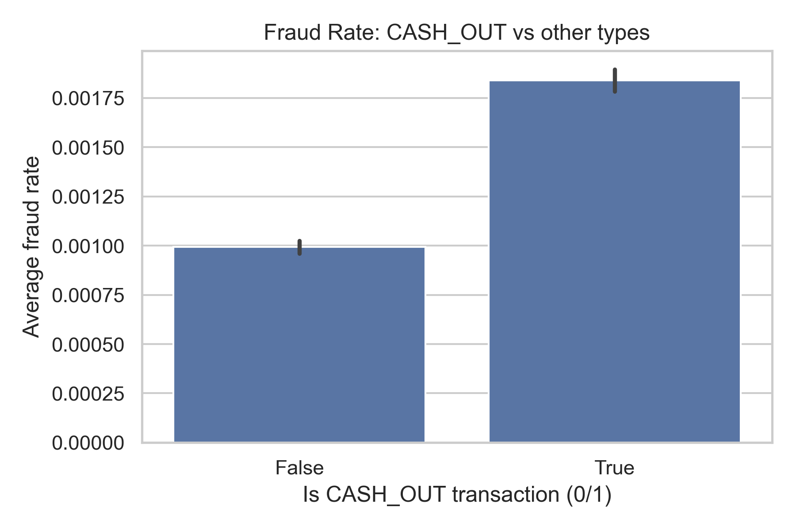
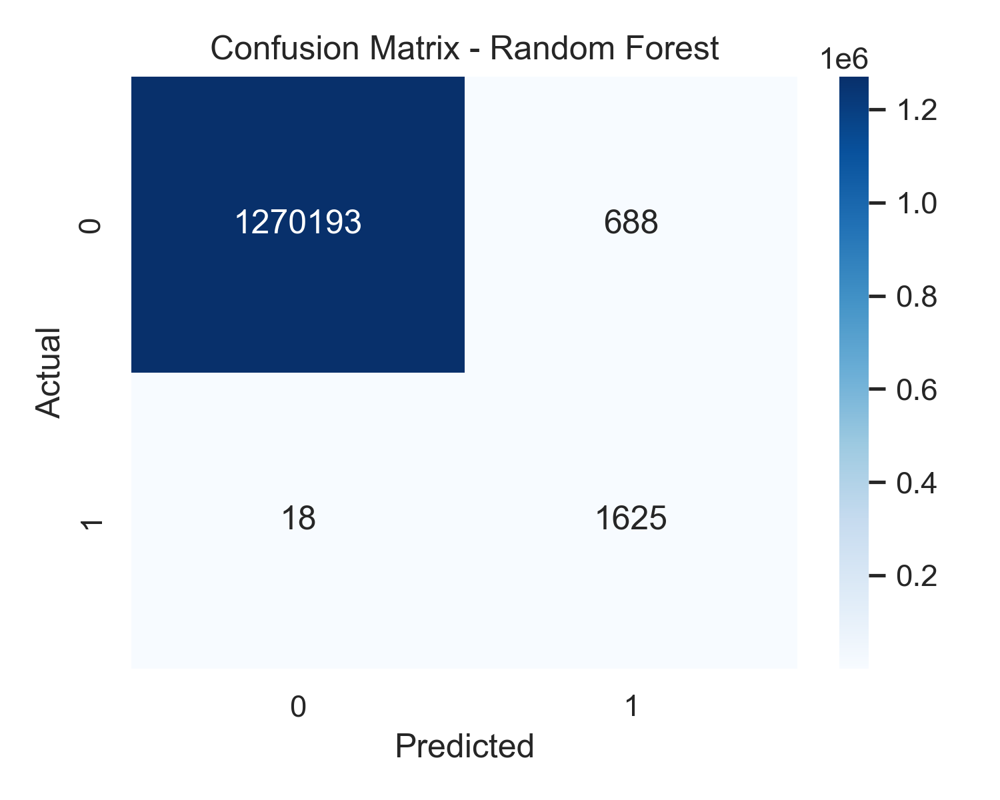
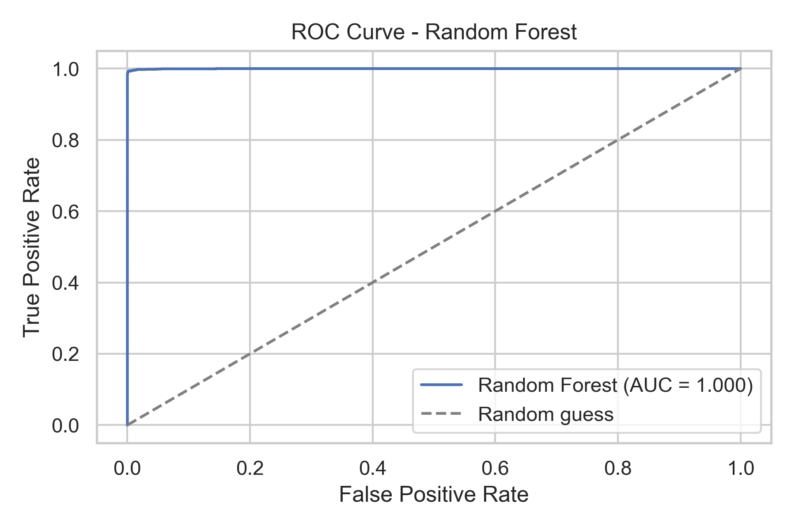

# Fintech Fraud Detection — End-to-End Machine Learning Project

## Overview
This project focuses on detecting fraudulent digital transactions using machine learning.  
Fraud in fintech platforms leads to financial loss and lower trust. The goal here is to analyze behavior patterns in transactions and build a model that improves fraud identification while minimizing false alerts for legitimate users.

The project includes:
- Data cleaning and feature engineering
- Exploratory data analysis
- Model training and evaluation
- Threshold tuning based on financial outcomes
- Practical recommendations aligned with fraud risk operations

---

## Dataset
Online payments dataset (public).  
Target variable:  
- `isFraud` → 1 = fraudulent transaction, 0 = legitimate

The dataset is extremely imbalanced, which reflects real-world fraud behavior.

---

## Key Insights from Analysis

| Insight | Why it matters |
|--------|----------------|
| Fraud mainly occurs in **TRANSFER** and **CASH_OUT** | Higher-risk flows that warrant stronger monitoring |
| Fraud often involves **merchant accounts** | Suggests need for improved merchant onboarding checks |
| Abnormal balance movements are strong indicators | Useful for real-time rule-based detection |
| Fraud values cluster in moderate ranges | Likely intended to bypass hard-coded limits |

---

## Model Performance

| Model | Strength | Notes |
|-------|----------|------|
| Logistic Regression | Interpretable baseline | Lower recall on fraud cases |
| Random Forest | Better ability to capture complex behavior | Chosen model |

Primary evaluation focus:
- **ROC-AUC** (ability to rank high-risk transactions)
- **Recall** on fraud class (catch rate)

---

---
## Visual Overview

### Class Imbalance

### Fraud by Transaction Type

### Amount vs Fraud

### Model Diagnostics
Confusion matrix and ROC curve for the chosen Random Forest model:

---

## Business Impact Modeling

A simplified financial model was used:

- ₹10,000 average loss per successful fraud
- ₹200 operational cost to review a flagged legitimate transaction

Threshold tuning was applied to
- increase prevented loss
- avoid excessive false alarms

This allows the model to be used as a **decision-support** tool rather than an isolated technical result.

---

## Tools & Technologies
- Python, Jupyter
- Pandas, NumPy, Matplotlib, Seaborn
- Scikit-learn

No external ML frameworks used — intentionally scoped for clarity.

---

## Future Improvements
- Better imbalance handling (e.g., SMOTE)
- Advanced models (XGBoost, Gradient Boosting Machines)
- Feature explainability for fraud analyst teams
- Incorporating time-series behaviour per account

---

## Author
**Avanti Bhattacharya**  
Data Science & Economics — Krea University  
Interests: product analytics, financial risk insights, ML for decision-making# Fraud-Detection-Fintech-DataScience-Project
# Fraud-Detection---Project-1
